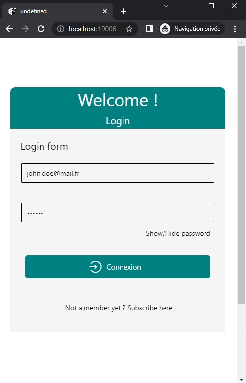
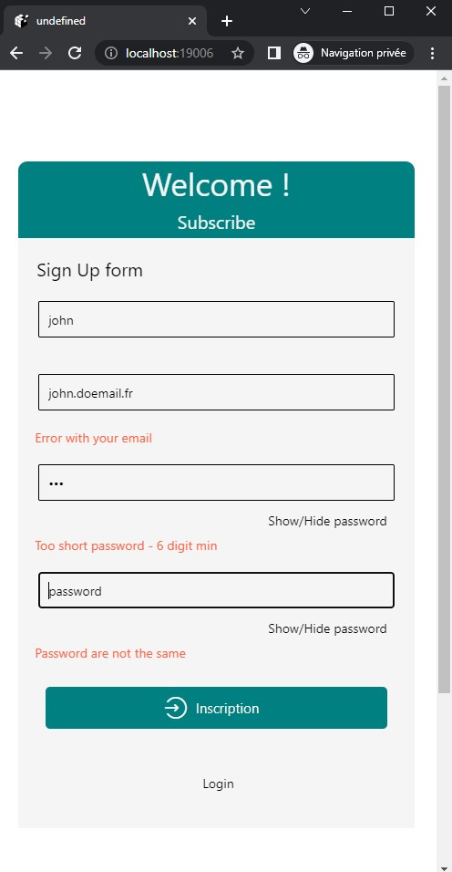
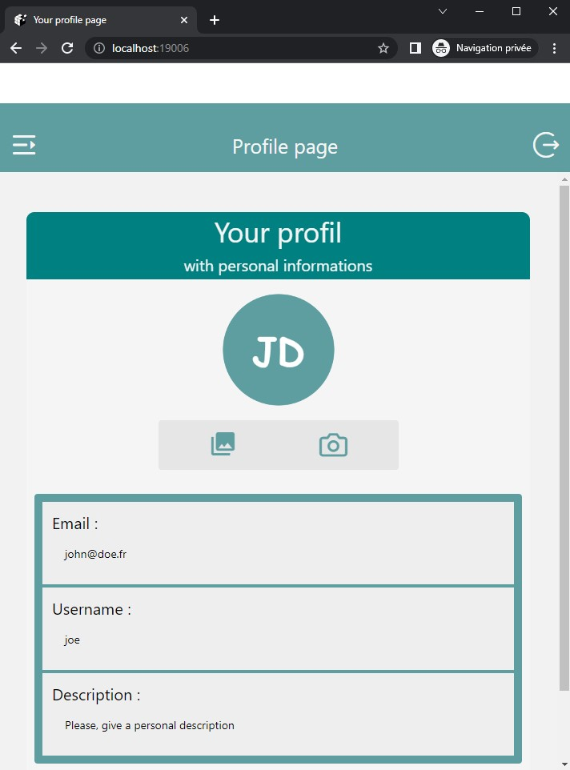
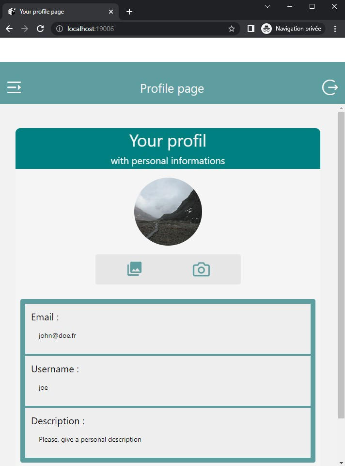
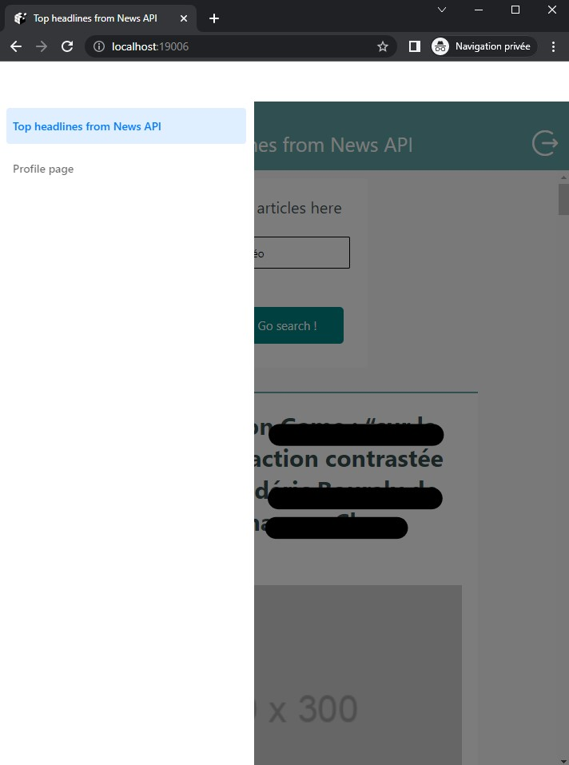
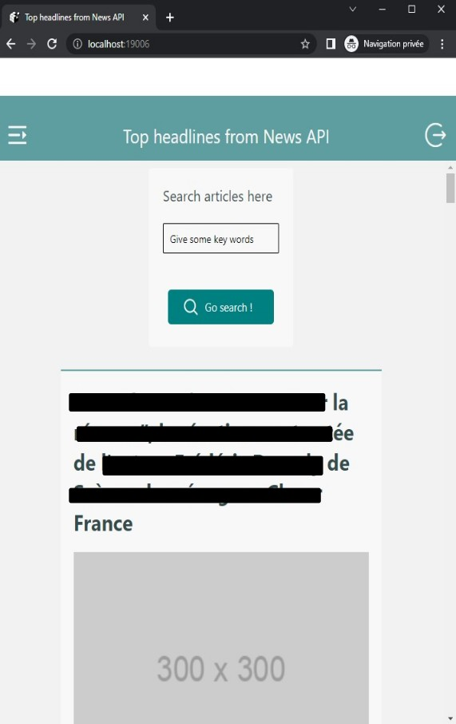
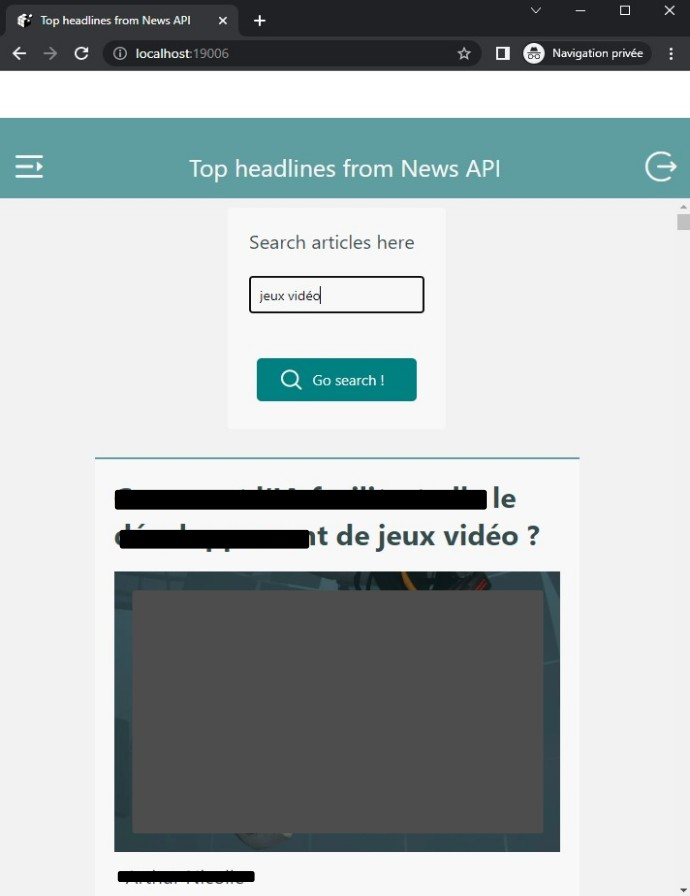
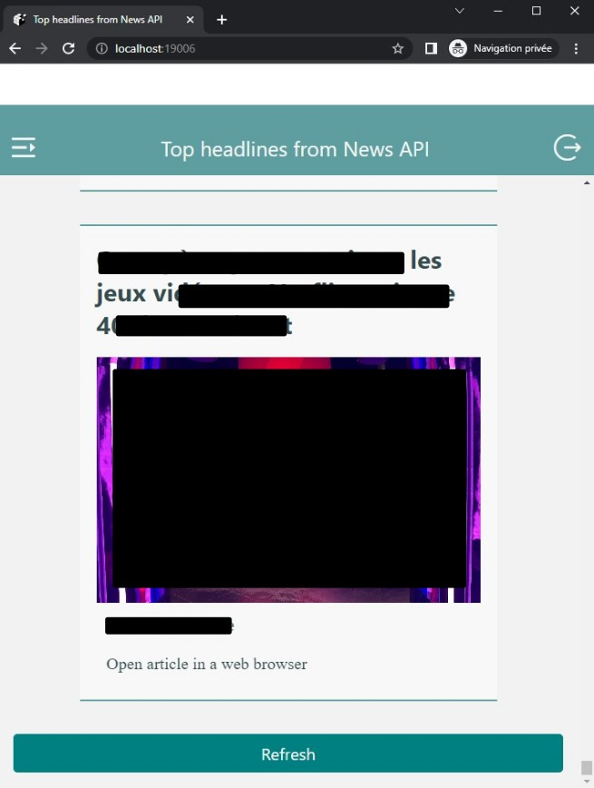

# React-Native NewsApp project

A simple news application.

Tests on Laptop and Android phone.

## Install

- Node.js 

check with 

    node-v

- Expo-cli

    npm install --g expo-cli

check install with :

    expo --version

---

## Init project

    npx create-expo-app my-app

    cd my-app


With the laptop, install dependencies :

    npx expo install react-native-web react-dom @expo/webpack-config


On mobile phone, install the Expo Go application


### Start dev

    npx expo start

or command :

!! With a CMD terminal (not a git bash for instance) !!

    set NODE_OPTIONS=--openssl-legacy-provider

    npx expo start --tunnel


and wait, IOS and Android bundling can take a while...


---

### Next - add these libraries to use navigation modes

    npx expo install @react-navigation/native

    npx expo install @react-navigation/stack

    npx expo install react-native-screens

    npx expo install react-native-reanimated

    npx expo install react-native-gesture-handler
    
    npx expo install react-native-safe-area-context


then check this setup in babel.config.js file

```js
module.exports = function (api) {
  api.cache(true);
  return {
    presets: ["babel-preset-expo"],
    plugins: [
      "@babel/plugin-proposal-export-namespace-from",
      [
        "react-native-reanimated/plugin",
        {
          relativeSourceLocation: true,
        },
      ],
    ],
  };
};

```


### Next - add this librairy to use phone camera

    npx expo install expo-camera


### Install Drawer (navigation)

    expo install @react-navigation/drawer

    npx expo install react-native-gesture-handler@~2.8.0 react-native-reanimated@~2.12.0

    npx expo start -c

## Screenshots of the app (laptop - with Chrome browser)

### Sign in form


&nbsp;

### Sign up form with checks



&nbsp;


### Profile page



&nbsp;

### Profile page with custom avatar picture



&nbsp;

### Navigation (Drawer)



&nbsp;

### News page - headlines



&nbsp;

### News page - search tool with key words



&nbsp;

### News page - refresh button and web browser link

